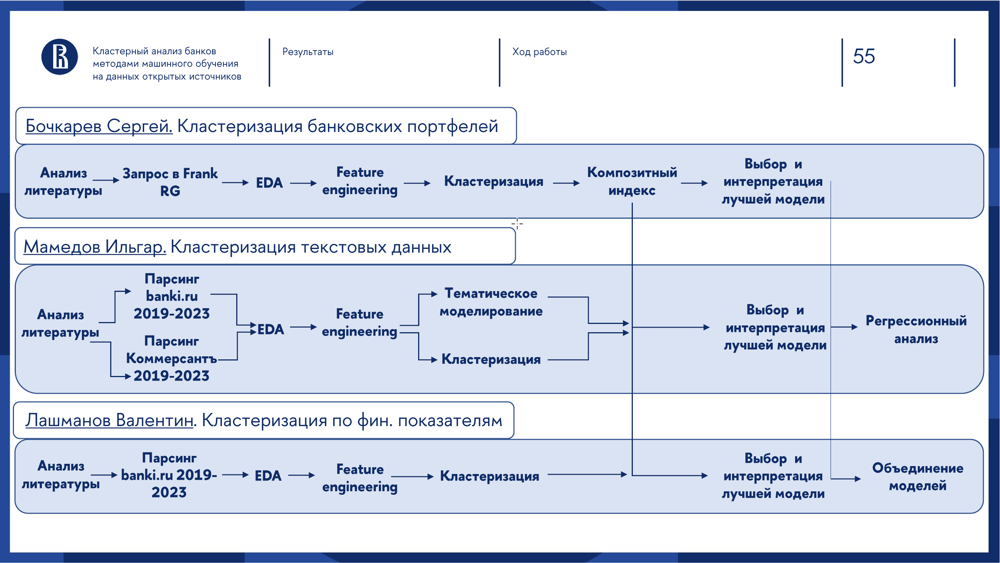

# Кластерный анализ банков методами машинного обучения на данных открытых источников
### Выполнили:
Мамедов Ильгар: https://t.me/Ilgar0727  
Бочкарев Сергей: https://t.me/incognitoergosum  
Лашманов Валентин: https://t.me/blausher   

### Информация о работе:

Данный проект выполнялся в рамках выпускной квалификационной работы на кафедре Банка России в НИУ ВШЭ.

__Основная цель:__ Построить инструмент для определения риск-профиля российских банков с помощью кластерного анализа на данных открытых источников.  
В рамках исследования было изучено 3 напрвления кластеризации:
* Финансовые показатели 
* Состав портфеля банка 
* Текстовые данные 

### Pipeline и распределение ролей:

  

### Навигация по репозиторию

`Portfolio_Clustering` - анализ портфельных данных

`banki_comments_parser` - парсер отзывов по банкам на сайте банки.ру

`finance_feature_clustering` - парсер и анализ финансовых показателей на сайте банки.ру

`kommersant_parser` - парсер новостных статей агества kommersant 

`Porregressionfolio_Clustering` - регрессионный анализ полученных кластеров

`research` - анализ текстовых данных

`data4regresssion` - объединение всех данных в один датасет