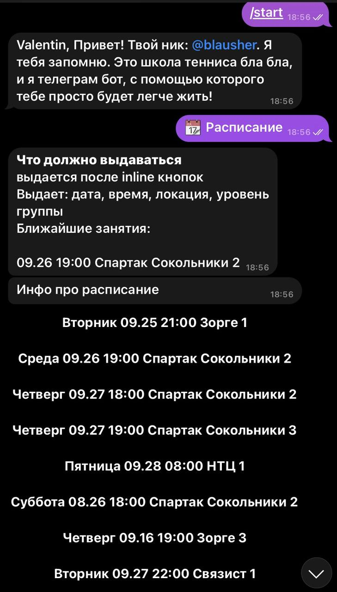

# Python tg tennis bot :tennis: (с использованием БД MySQL и ORM SQLAlchemy)

Это проект телеграм бота, который заменяет деятельность менеджера тренировок по большому теннису. Вместо того, чтобы писать клиенту, спрашивать, когда ему было бы удобно потренироваться, клиенты сами выбирают удобное для них время и записываются на тренировки. В БД отображается актуальное состояние (сколько людей в какое время на какую тренировку хотят прийти).

## Архитектура 

  

## Возможности бота
### Раскладка на главном экране

  

- При нажатии на кнопку `/start` в БД записывается телеграми никнейм и имя пользователя, которое будет использоваться при оплате и записи на тренировки
- При нажатии на кнопку __"Цены"__ пользователю присылается табличка с акутальными условиями и стоимостью тренировок
- При нажатии на кнопку __"info, корты, отзывы"__ пользователю присылаются inline кнопки со ссылками на сторонние сайты
- При нажатии на кнопу __"Расписание"__ пользователю отправляются inline кнопки с возможностью выбрать удобное время и место для проведения тренировки. Отправляется столько inline кнопок, сколько доступных слотов есть для тренировок.

Кнопка __"Расписание"__ отправляет запрос к БД, а БД возвращает табличку с актуальными слотами тренировок. Слот считается актуальным, если current datetime < planned_daytime (то есть, если тренировка еще не прошла). Пршедшие тренировки сохраняются в БД, но пользователю не отображаются. 
Когда пользователь впервые нажимает кнопку `start`, бот сохраняет его контакты в таблицу clients, когда человек кликает на возможный вариант тренировок. В БД создается запись: id пользователя -  id тренировки (на которую пользователь записался).
 
### Команды: Цены, назад и info

  

### Команды: приветствие пользователя и расписание

  

